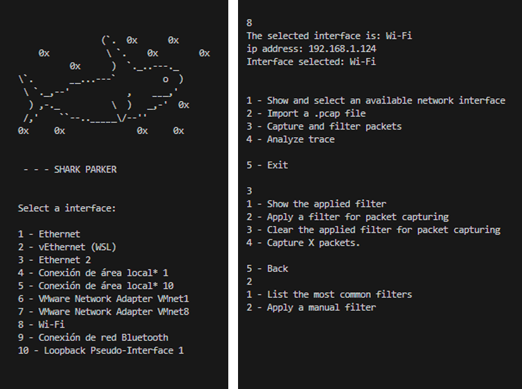
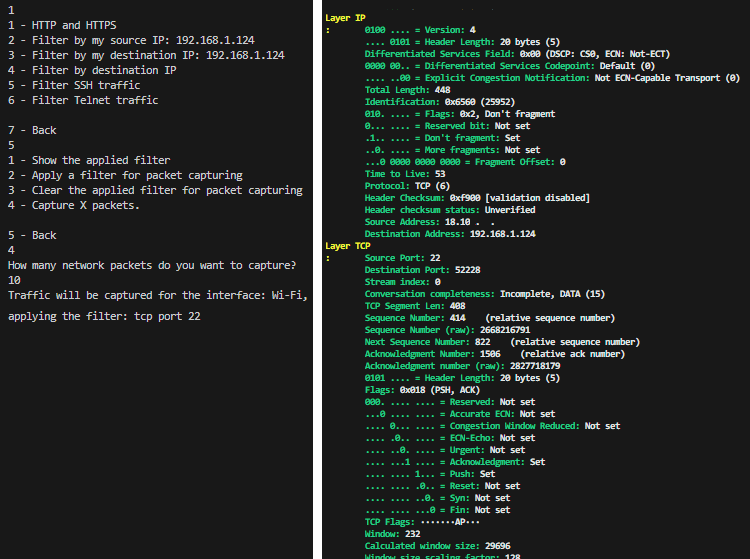
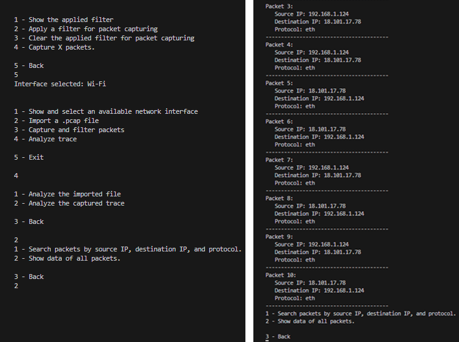

# Shark Parker

Small network packet capture and analysis program developed with Python (Pyshark). Explore the different options: import your own .pcap files, capture, filter, and analyze.

## Table of Contents

1. [Getting Started](#gettin-started)  
1.1. [Prerequisites](#prerequisites)
2. [Deployment](#deployment)
3. [How to run the program](#how-to-run-the-program)  
3.1 [Demo](#demo)
4. [Next steps](#next-steps)  
5. [Built with](#built-with)
6. [Autor](#autor)
7. [License](#license)


<a name="gettin-started"></a>
## 1 - Getting Started 🚀

Follow these instructions to run the program smoothly on your computer
<a name="prerequisites"></a>
### 1.1 - Prerequisites  📋

🐍 **Python**

Python is the programming language with which the entire application is built.

You can download Python from its official website: https://www.python.org/downloads/

For the proper functioning of this program, you need to have some additional Python libraries installed:

📚 **pyshark**

Pyshark is a Python library for capturing and analyzing network traces. You can install it using the command:

```
pip install pyshark
```

📚 **psutil**

To obtain information about network interfaces. You can install it using the command:

```
pip install pyshark
```

💻 **Windows**

⚠ This project is designed (for now) and tested to run on Windows environments.

<a name="deployment"></a>
## 2 - Deployment 🔧

To obtain and run this project:

**Clone** this repository using

```
git clone https://github.com/0xTrivi/shark-parker.git
```

Alternatively, download the Zip from the Code tab. It doesn't matter the destination directory.

<a name="how-to-run-the-program"></a>
## 3 - How to Run the Program ⚙

⚠ For the project to function correctly, you will have to run it with administrator permissions.

The usage of the application is quite simple. To run the program, execute the `main.py` file located in the root of the project in the way you prefer. If you do it through the terminal, you can simply use:
```
python main.py
```
Once you run it, perform the initial checks, and choose the network interface you want to work with, the initial menu will be displayed.

<a name="demo"></a>
### 3.1 - Demo 👁

When running the program, it will display our list of interfaces. I will choose number 8 (my Wi-Fi adapter).
Now, it shows us the main menu. We have 4 available options: Select another interface, import a trace, capture packets, or analyze a trace. I will choose to capture packets.
In this new menu, I will select to apply a filter to the capture (option 2) and show the most common filters. 



I will choose option 5 to filter ssh traffic.
Next, I will capture traffic with that filter (option 4). I will specify that I want to capture 10 packets.



Once captured (a connection to a test machine I set up in AWS), besides being displayed, the packets have been stored in the BUFFER_PACKETS dictionary. I will go back (option 5) and move to the analysis menu (option 4). With option 2, I specify that I want to analyze the packets from the trace and that I want to display all packets (I could filter by source IP, destination IP, and protocol).

This would be a basic example of using the program. It is quite easy to navigate through it and it offers several possibilities. If you liked it, follow the project to see new features or add your own.



<a name="next-steps"></a>
## 4 - Next steps 👣

Many new features can be added to the project, such as an increased number of default filters, the option to export (in JSON format in addition to .pcap) to complement the current import feature, or a more user-friendly interface for the user, although the first thing I will do is group related functions to separate them into different files and have a better organization.

Regarding the information displayed with the packets, you simply need to add the fields you want to extract in the analyze_packet function and then pass them to print_packet (you will also need to modify the input arguments and prints in print_packet).

Additionally, the project could be packaged into a container to eliminate the dependency on installing libraries and to avoid issues related to different operating systems.

<a name="built-with"></a>
## 5 - Built with 🛠️

* [Python 3.10.10](https://www.python.org/downloads/release/python-31010/) 
* [VSC](https://code.visualstudio.com/download) - IDE
<a name="autor"></a>
## 6 - Autor ✒️

* **Cristian Triviño Estévez** - [github](https://github.com/0xTrivi)
<a name="license"></a>
## 7 - License 📄

This project is under the GNU General Public License v3.0: [LICENSE](LICENSE)

---
Happy coding ❤️